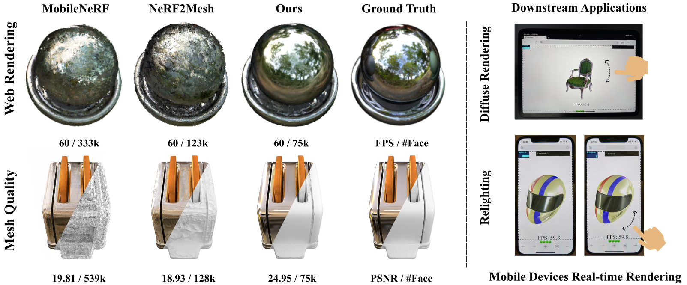
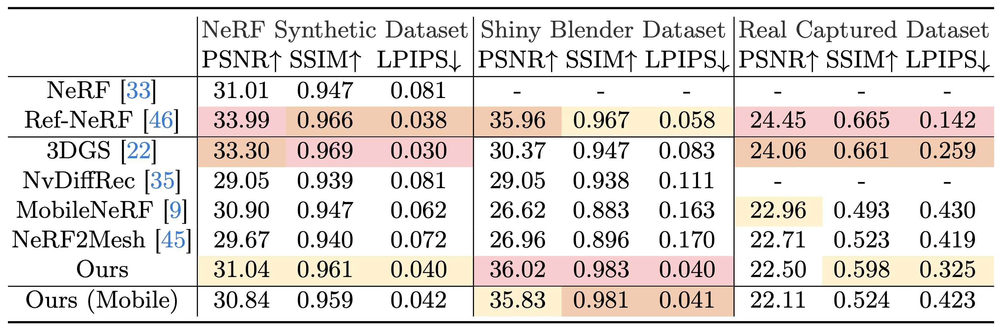
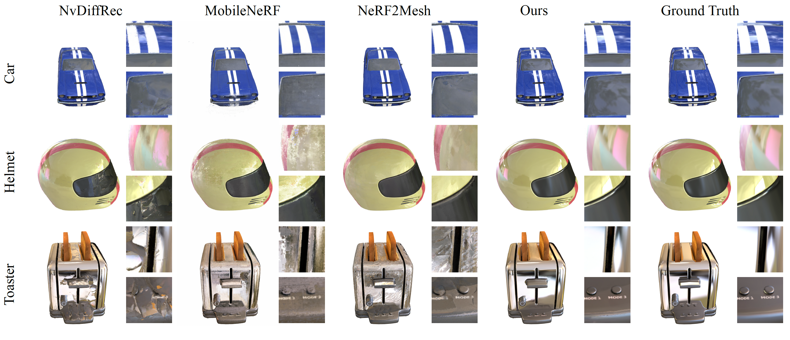

<h1 align="center">REFRAME: Reflective Surface Real-Time Rendering for Mobile Devices (ECCV 2024)</h1>

[](https://arxiv.org/abs/2403.16481)

Chaojie Ji, Yufeng Li,  [Yiyi Liao](https://yiyiliao.github.io/)

**Keywords**: Reflective surface · Real-time rendering · Mobile device

**Abstracts**: This work tackles the challenging task of achieving real-time novel view synthesis for reflective surfaces across various scenes.  Existing real-time rendering methods, especially those based on meshes, often have subpar performance in modeling surfaces with rich view-dependent appearances. Our key idea lies in leveraging meshes for rendering acceleration while incorporating a novel approach to parameterize view-dependent information. We decompose the color into diffuse and specular, and model the specular color in the reflected direction based on a neural environment map. Our experiments demonstrate that our method achieves comparable reconstruction quality for highly reflective surfaces compared to state-of-the-art offline methods, while also efficiently enabling real-time rendering on edge devices such as smartphones. 

Our project page can be seen at https://xdimlab.github.io/REFRAME/.




## :book: Table Of Contents
- [:house: Installation](#house-Installation)
- [:framed_picture: Initialization (Dataset and Initial mesh)](#framed_picture-Initialization (Dataset and Initial mesh))
- [:computer: Usage](#computer-Usage)
- [:chart_with_upwards_trend: Results](#chart_with_upwards_trend-Results)
- [:clipboard: Citation](#clipboard-citation)
- [:sparkles: Acknowledgment](#sparkles-acknowledgement)
- [:e-mail: Contact](#e-mail-contact)


## :house: Installation
A suitable [conda](https://www.anaconda.com/) environment named `REFRAME` can be created and activated with:
```
# clone this repository
git clone https://github.com/MARVELOUSJI/REFRAME

# create new anaconda environment and activate it
conda create -n REFRAME python=3.8
conda activate REFRAME

#install pytorch 
conda install pytorch==1.12.1 torchvision==0.13.1 torchaudio==0.12.1 cudatoolkit=11.3 -c pytorch

#install nvdiffrast
git clone https://github.com/NVlabs/nvdiffrast.git
cd nvdiffrast
python -m pip install .

#install tiny-cuda-nn
cd ../
sudo apt-get install build-essential git

#export cuda path (change the cuda version of your own)
export PATH="/usr/local/cuda-11.3/bin:$PATH"
export LD_LIBRARY_PATH="/usr/local/cuda-11.3/lib64:$LD_LIBRARY_PATH"

git clone --recursive https://github.com/nvlabs/tiny-cuda-nn
cd tiny-cuda-nn
cmake . -B build
cmake --build build --config RelWithDebInfo -j
cd bindings/torch
python setup.py install

#install the rest package
cd ../../../REFRAME
pip install -r requirements.txt
```
For more details on tiny-cuda-nn and nvdiffrast, you can visit [tiny-cuda-nn](https://github.com/nvlabs/tiny-cuda-nn#pytorch-extension) and [nvdiffrast](https://github.com/NVlabs/nvdiffrast).

## :framed_picture: Initialization (Dataset and Initial mesh)

1. NeRF Synthetic Dataset

- You can download the NeRF Synthetic dataset from their [project page](https://www.matthewtancik.com/nerf).
- We use [NeRF2Mesh](https://github.com/ashawkey/nerf2mesh) to obtain our initial mesh for the NeRF Synthetic dataset.
- Or you can download our initial mesh used in the paper from [here](https://drive.google.com/file/d/1BvlQAvc1grfuKPyv2o5KcOApW-ohipIg/view?usp=drive_link).
- For hotdog and ship scene, you need to adjust the --scale to 0.7. For other scenes, the default scale (0.8) works fine.

2. Shiny Blender Dataset

- You can download the Shiny Blender dataset from their [project page](https://dorverbin.github.io/refnerf/).
- We use [Ref-NeuS](https://github.com/EnVision-Research/Ref-NeuS) to obtain our initial mesh for the Shiny Blender dataset.
- Or you can download our initial mesh used in the paper from [here](https://drive.google.com/file/d/1STYzHG9F9BXjJJov9kDhymMMg_kDOiOo/view?usp=drive_link).
- Note that for Ref-NeuS initial mesh, you need an additional file 'points_of_interest.ply' in the dataset path (see Ref-NeuS's  [repo](https://github.com/EnVision-Research/Ref-NeuS) for details) and set --refneus 1. The ply is also included in the zip of the Shiny Blender dataset initial mesh above but named after the dataset. You need to download it and change the name to 'points_of_interest.ply' and place it in the dataset path. As follows:

<pre>
+-- ShinyBlender
|   +-- helmet
|       +-- test
|       +-- train
|       +-- points_of_interest.ply
|       +-- transforms_test.json
|       +-- transforms_train.json
    +-- toaster
</pre>

3. Real Captured Dataset

- You can download the Real Captured dataset from their [project page](https://dorverbin.github.io/refnerf/).
- We use [NeRF2Mesh]((https://github.com/ashawkey/nerf2mesh))  and [Neuralangelo](https://github.com/NVlabs/neuralangelo) to obtain our initial mesh for the Real Captured dataset.
- Since the initial mesh of the Real Captured dataset in our paper is of poor quality and has large memory overhead. Therefore, we do not provide the initial mesh for the Real Captured dataset.

4. Self Captured Dataset

- Users can capture scenes on their own. We support both blender and colmap formats.
- We recommend users to follow [NeRF2Mesh]((https://github.com/ashawkey/nerf2mesh)) to process their data for training.


## :computer: Usage

```bash
#Training with default setting
python main.py --datadir your_dataset_path --initial_mesh your_initial_mesh --run_name experiment_name

#Training without environment learner (directly optimizing a feature map.) Should speed up training process but loss of quality.
python main.py --datadir your_dataset_path --initial_mesh your_initial_mesh --run_name experiment_name --wenvlearner 0

#Testing and UVmapping (Default setting)
python main.py --datadir your_dataset_path --initial_mesh your_trained_mesh --run_name experiment_name --shader_path trained_shader --test 1 --uvmap 1 

#Testing and UVmapping (Training without environment learner)
python main.py --datadir your_dataset_path --initial_mesh your_trained_mesh --run_name experiment_name --wenvlearner 0 --shader_path trained_shader --envmap_path trained_envmap --test 1 --uvmap 1 
```

## :chart_with_upwards_trend: Results



**Quantitative Comparison**. Baseline comparisons of the rendering quality on three different datasets. <span style="color:red; font-weight:bold;">Red</span> represents the optimal, <span style="color:orange; font-weight:bold;">orange</span> represents the second best, and <span style="color:#FFD700; font-weight:bold;">yellow</span> represents the third.



**Qualitative Comparison**. Our method achieves optimal rendering quality in most scenes and provides better modeling of reflective appearance compared to the baselines.

## :clipboard: Citation

If our work is useful for your research, please consider citing:

```
@article{ji2024reframe,
  title={REFRAME: Reflective Surface Real-Time Rendering for Mobile Devices},
  author={Ji, Chaojie and Li, Yufeng and Liao, Yiyi},
  journal={arXiv preprint arXiv:2403.16481},
  year={2024}
}
```

## :sparkles: Acknowledgement

- This work is supervised by [Yiyi Liao](https://yiyiliao.github.io/) who leads the [X-D Lab](https://yiyiliao.github.io/xdlab/) of ZJU.
- Some codes are brought from [NeRF2Mesh](https://github.com/ashawkey/nerf2mesh) and [neural-deferred-shading](https://github.com/fraunhoferhhi/neural-deferred-shading).
- This Readme is inspired by [BFRffusion](https://github.com/chenxx89/BFRffusion).

## :e-mail: Contact

If you have any questions, please feel free to reach out at `jichaojie@zju.edu.cn`.
